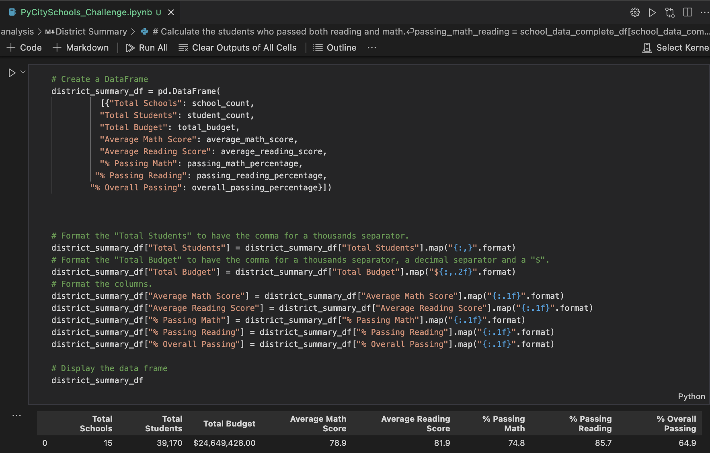
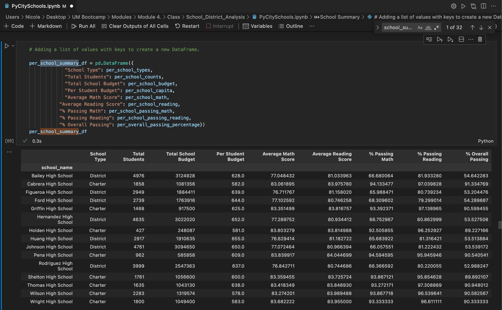
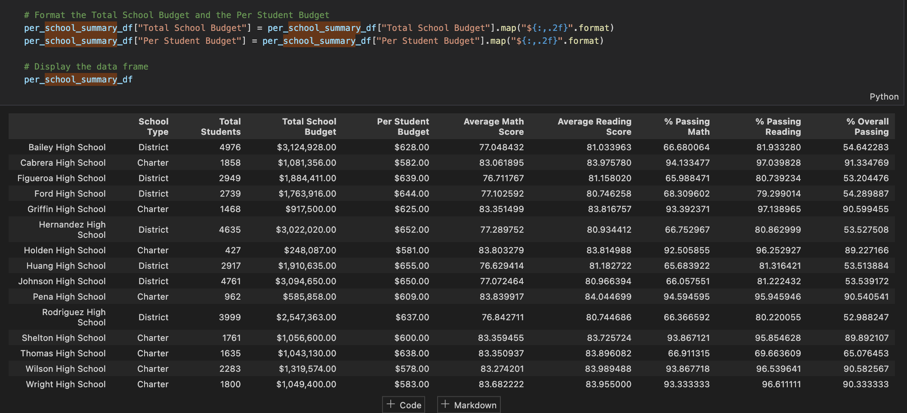

# School_District_Analysis

There is evidence of academic dishonesty in the math and reading grades of ninth graders coming from Thomas High School. For the school board to uphold state-testing standards, math and reading scores of these ninth graders must be replaced with NaNs while keeping the rest of the data intact.

## Purpose
The purpose of this analysis is to recreate the school district analysis, in which "NaN" is used to replace the math and reading scores of the ninth graders from Thomas High School. Then we will analyze how these changes affected the overall analysis.

# Results

## How is the district summary affected?

- Original school district analysis

- Recreated school district analysis

There was little to no change on any of the metrics on the district level.

## How is the school summary affected?

- Original school district analysis

- Recreated school district analysis

In the school summary, there is little to no change on the average math and reading scores. However, in the recreated analysis, we see a big percentage drop in "% passing" rates for math and reading, as well as a big percentage drop in "% verall passing".
- Math went from a % passing rate of 93.3% to 66.9%
    - A difference of 26.4%
- Reading went from a % passing rate of 97.3% to 69.7%
    - A difference of 27.6%
- % overall passing went from 90.9% to 65.1%
    - A difference of 25.8%
 

## How does replacing the ninth graders’ math and reading scores affect Thomas High School’s performance relative to the other schools?

In terms of "% overall passing", Thomas High School was one of the top schools, landing #2 on the list. However, after replacing the ninth graders' math and reading scores with "NaN", THS ended up being the lowest ranking school in terms of "% overall passing".

## How does replacing the ninth-grade scores affect the following:

### Math and reading scores by grade
- There was not much change in the average math or reading scores. 

### Scores by school spending
- There is a negative correlation between school spending per student and the percent of passing rate. As school spending per student increases, percent of passing rate decreases. 
    - Since Thomas High School spent significantly more than other schools, we would expect a THS to follow a similar trend, in which THS would reflect an % overall passing in the 60s range.
    Originally, the overall passing rate was 90.9%, and now it is 65.1% which is similar to the rest of the schools who spent around the same amount as THS. 

### Scores by school size
- Thomas High School is a medium sized school. After removing the ninth graders' math and reading scores, the overall % passing rate decreased, bringing down the school's ranking.

### Scores by school type
- Across all charter schools, the average percentage of  overall passing students is 90%. In the original school district analysis, Thomas High School had around the same average as the rest of the charter schools, an average of 90.9 % overall passing rate. However, by removing the ninth grade test scores, the % overall passing rate for Thomas High School droped to 65.1%.